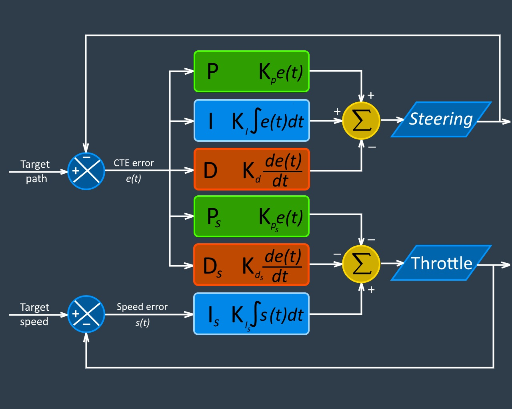

## PID controller

PID controller implementation for car racing around the track.

---

### References and dependences

This project involves the Udacity Term 2 Simulator which can be downloaded [here](https://github.com/udacity/self-driving-car-sim/releases)

This repository includes two files that can be used to set up and install [uWebSocketIO](https://github.com/uWebSockets/uWebSockets) for either Linux, Mac or Windows systems.

For Windows there are 2 ways run this code:
1. Install [vcpkg](ttps://github.com/Microsoft/vcpkg) package manager first (please, install base packages as well accordingly to instruction). Than run
`vcpkg install uwebsockets` from command line to install uWebSocketIO. To build project I recommend use Visual Studio 2017 [Open Folder project](https://docs.microsoft.com/en-us/cpp/ide/non-msbuild-projects). This is option I used myself. **Note: Depends on your vcpkg installation location you need modify CMakeSettings.json file and replace `C:\\vcpkg-master\\scripts\\buildsystems\\vcpkg.cmake` with your path to vcpkg.cmake.**

2. Use Udacity recommnded either Docker, VMware, or even [Windows 10 Bash on Ubuntu](https://www.howtogeek.com/249966/how-to-install-and-use-the-linux-bash-shell-on-windows-10/) to install uWebSocketIO. Please see [this concept in the classroom](https://classroom.udacity.com/nanodegrees/nd013/parts/40f38239-66b6-46ec-ae68-03afd8a601c8/modules/0949fca6-b379-42af-a919-ee50aa304e6a/lessons/f758c44c-5e40-4e01-93b5-1a82aa4e044f/concepts/16cf4a78-4fc7-49e1-8621-3450ca938b77) for the required version and installation scripts.

The main program can be built and run by doing the following from the project top directory.

1. mkdir build
2. cd build
3. cmake ..
4. make
5. ./pid

In Windows, Visual Studio 2017 can be used.

Udacity tips for setting up your environment can be found [here](https://classroom.udacity.com/nanodegrees/nd013/parts/40f38239-66b6-46ec-ae68-03afd8a601c8/modules/0949fca6-b379-42af-a919-ee50aa304e6a/lessons/f758c44c-5e40-4e01-93b5-1a82aa4e044f/concepts/23d376c7-0195-4276-bdf0-e02f1f3c665d)

Other Important Dependencies:

* cmake >= 3.5
  * All OSes: [click here for installation instructions](https://cmake.org/install/)
* make >= 4.1 (Linux, Mac), 3.81 (Windows)
  * Linux: make is installed by default on most Linux distros
  * Mac: [install Xcode command line tools to get make](https://developer.apple.com/xcode/features/)
  * Windows: [Click here for installation instructions](http://gnuwin32.sourceforge.net/packages/make.htm)
* gcc/g++ >= 5.4
  * Linux: gcc / g++ is installed by default on most Linux distros
  * Mac: same deal as make - [install Xcode command line tools](https://developer.apple.com/xcode/features/)
  * Windows: recommend using [MinGW](http://www.mingw.org/)

### Project content
* [CMakeLists.txt](./CMakeLists.txt) - make file, extended with *Windows* instructions.
* [CMakeSettings.json](./CMakeSettings.json) **(Windows only)** - Visual Studio 2017 Open Folder configuration. Includes instructions how to build your project. **Note: Depends on your vcpkg installation location you need modify CMakeSettings.json file and replace `C:\\vcpkg-master\\scripts\\buildsystems\\vcpkg.cmake` with your path to vcpkg.cmake.**
* [install-mac.sh](./install-mac.sh) **(Mac only)** - installation script for Mac.
* [install-ubuntu.sh](./install-ubuntu.sh) **(Linux only)** - installation script for Linux (Ubuntu).
* [images](./images) - folder, images for this document.
* [src](./src) - source code.
* [writeup.md](./writeup.md) – project description in details
* [video.mp4](./video.mp4) – video-report (one track circle with best parameters).

#### Source code

* [pid.h](./src/pid.h), [pid.cpp](./src/pid.cpp) - implementation of PID controller for steering, throttle and with parameter optimization.
* [main.cpp](./src/main.cpp) - Main class, starts web-service to process sensors data from simulator. This class was customized to be possible run in Windows. `vcpkg` installs only latest version of `uWebSocketIO`, which not compatible with previous versions. Code was just duplicated to make possible work with both versions of `uWebSocketIO`. If you run code on Linux or Mac, it's assumed that `e94b6e1` branch was installed by scripts provided. But in case you want build this project with latest version of `uWebSocketIO`, just change `#define _NEW_UWS_VERSION (false)` to `#define _NEW_UWS_VERSION (true)`. You can also define local host with help of `#define _HOST ("127.0.0.1")`. **Note: Host is mandatory for Window, otherwise simulator cannot find server.**
