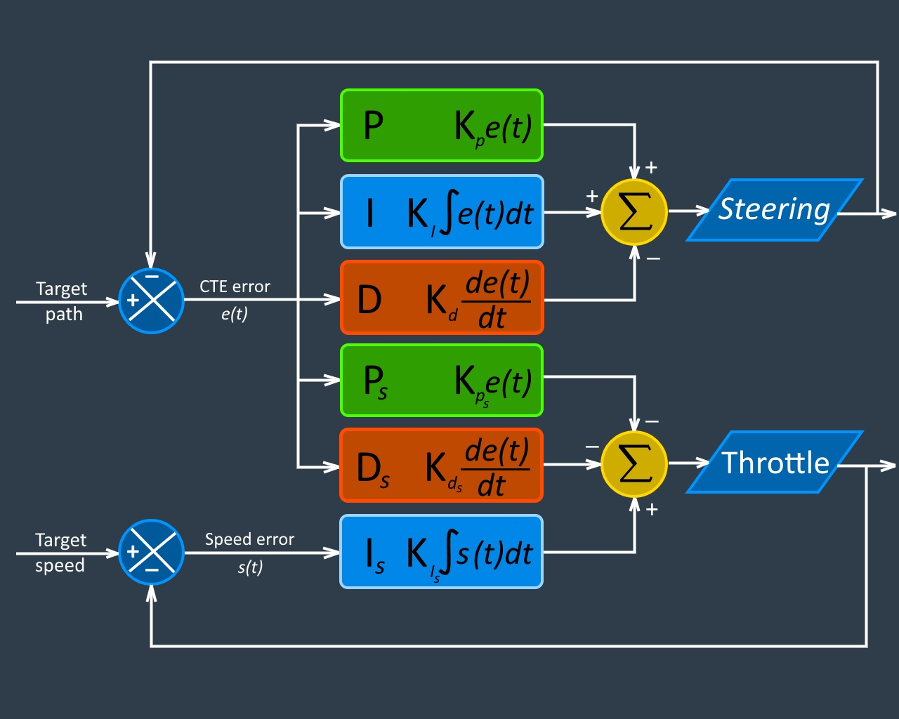

## PID controller

PID controller implementation for car racing around the track.

#### 1. Visualization
This is visualization of PID controller algorithm. It's based on classic PID controller, but changed a bit to reflect impact of each particular parameter on vehicle behavior.

#### 2. Describe the effect each of the P, I, D components had in your implementation
This PID controller is designed to manage simultaneously steering angle of vehicle and throttle (acceleration) value.

##### 2.1 Set points
Discussion of PID model must be started from target values (or it called set points in literature):
1. Set point for steering controller is a target path - imaginary line in the center of the road. Vehicle must go maximally close to this line.
2. Set point for speed controller is target speed. In my code it is maximal possible speed of simulated car - 100 m/h. Moreover, I assume that without impact of PID controller throttle value will be maximal possible - maximal acceleration.

##### 2.2 Error functions
Error functions is next component of PID controller:
1. Error function for steering controller is tangential distance between real car position and target path. This distance is called cross-track error (or CTE). On schema it is represented by *e(t)* function.
2. Error function for speed controller is difference between real car speed and target speed. On schema it is represented by *s(t)* function.

##### 2.3 Controller functions and it parameters
Lets' discuss controller functions and it parameters. And impact it cause on car behavior.
* **P** - proportional component of steering controller. It have positive impact on steering angle - bigger distance from target path, bigger CTE, bigger steering angle. **Kp** parameter defines how aggressive steering must be. Bigger value - more rapid reaction on changes of the target trajectory. But as result bigger value of angle car cross path line. The best value when car trajectory shape close to outer turn shape. Please see the sketch below.

* **D** - differential component of PID controller. Uses speed of CTE change to prevent path line crossing with big angles. It prevents oscillation across path line and makes trajectory more smooth. This parameter decreases steering angle when CTE value is decreasing too fast. And increases it, if CTE value is increasing too fast. Naturally, maximal speed of CTE change is near target path line. So D parameter turns vector of vehicle speed to minimize angle between this vector and path line. Please see the sketch below.

* **I** - integral component of PID controller. It accumulates all CTE (with it sign) for last 10 seconds. It is used to enforce vehicle move towards target trajectory. In case vehicle keeps one side of trajectory for a relatively long time, it means steering force is not enough and must be increased. Classic PID implementation accumulates integral parameter along whole object life. But it's not so practical. If look on trajectory of PD controller, we see that it's not symmetrical. So it tends to accumulate constant error and as result car will tend to over-steering in one direction and understeering in other. And finally lose it track. I take in account last 10 seconds of car life. For example, if vehicle loss it track, integral component helps return very fast back. Please see the sketch below.

* **Ps** - proportional speed decreasing parameter. In case car decline from target trajectory, acceleration is decreased proportionally do CTE. It helps vehicle effectively slowdown if vehicle declines from target path too much.

* **Ds** - differential speed decreasing parameter. If CTE decreases too fast, it means car trajectory shape is changed and car going to lose it. Speed of CTE change will be proportional to the radius of turn and vehicle speed must be decreased as well to take this turn. And vice versa, when car exit from turn, CTE speed is decreasing and eventually it changes its sign and increasing again. In this case speed must be increased as well to exist turn by the most smooth trajectory. It's exactly same the racing cars do!

* **Is** - integral speed increasing parameter. It forces speed increasing proportionally to difference between average speed for last 10 seconds and target speed. If car speed is too slow, it must be accelerated more. And vice versa.

#### 3. Describe how the final hyperparameters were chosen
Find a balance between 6 parameters is really complex task. So I used next algorithm:
1. Output impact of each parameter separately for debug purpose.
2. Depends on debug output did rough estimation of parameters.
3. Tuned PID parameters manually for fixed car speed 30 m/h.
4. Added PsIsDs parameters for speed controller and tuned it manually.
5. When initial parameters were defined and car was able stay on track, I did fine-tuning with help of Twiddle algorithm.

##### 3.1 Twiddle algorithm

This is a gradient descent algorithm which tune parameters one-by one to decrease value of error function. I tried several error functions:
1. Integral quadratic CTE error. In each moment of time, average of current and previous CTE error is squared and multiplied by time difference between previous and current measurements: `0.25 * (CTE + LAST_CTE)^2 * dt^2`.
2. Speed error - just speed of passing fixed distance (1-3 track circles).
3. Average tangent of target path crossing across several track circles. Less value - more smooth trajectory: `|CTE - LAST_CTE| / (speed * dt)`.
I used all 3 functions to fine-tune parameters.

Twiddle algorithm is very simple (I used a bit modified version):
1. Try change one of parameters on some delta value.
2. In case error function value is decreased, save this value and increase delta magnitude. Next time we will try move parameter a bit more in the same direction.
3. In case error function value not changed or increased, return parameter value back, decrease delta magnitude and change it sign. Next time we will try move parameter in opposite direction and with less magnitude.
4. Tune next parameter in the same way.
5. Repeat all steps with new deltas.
